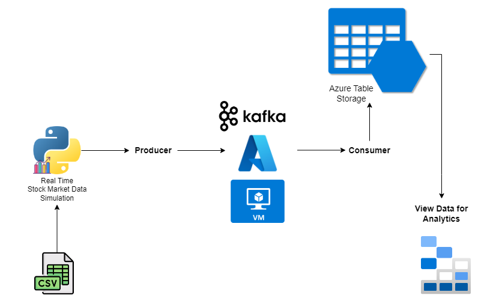

# Stock Market Kafka Real Time Data Engineering Project

## Introduction 
In this project, you will execute an End-To-End Data Engineering Project on Real-Time Stock Market Data using Kafka.

We are going to use different technologies such as Python, Azure Cloud, Apache Kafka, Azure Table Storage, and SQL.

## Architecture 

## Technology Used
- Programming Language - Python
- Azure Cloud Services
- Azure Table Storage
- Apache Kafka

## Dataset Used
You can use any dataset, we are mainly interested in operation side of Data Engineering (building data pipeline) 

Here is the dataset used I used - https://github.com/salman3-029/kafka-azure-data-engineering-project/blob/master/indexProcessed.csv

